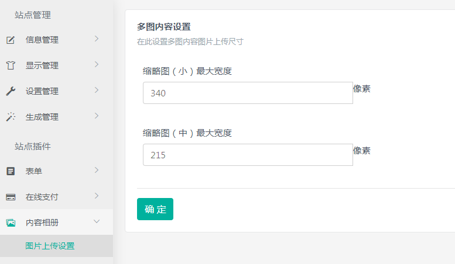
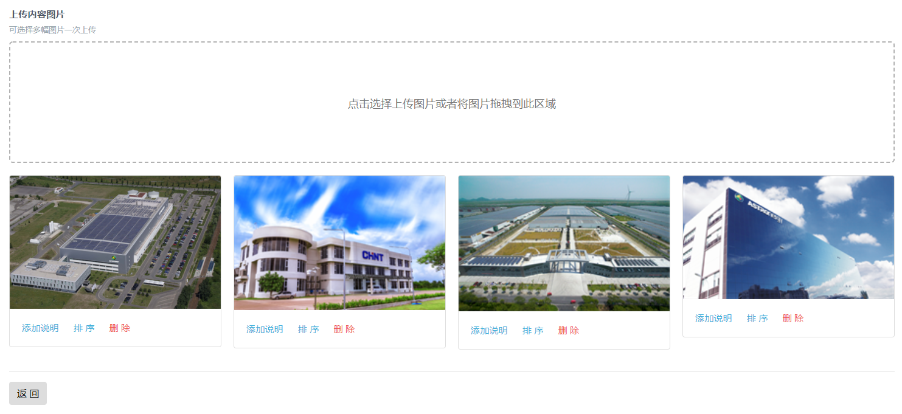
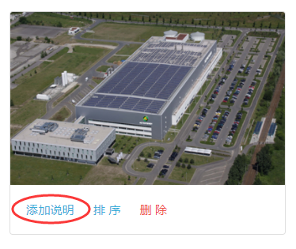
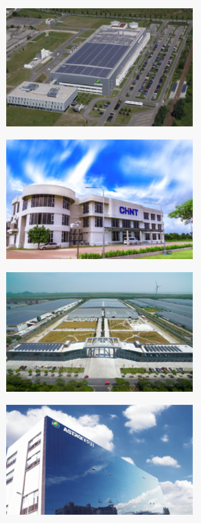

## 插件的使用

内容相册插件安装好之后，在后台左侧将出现**内容相册**菜单项。

### 多图上传设置

* 插件安装成功后，在图片上传设置中设置多图的缩略图尺寸



### 内容相册插件使用

* 在栏目管理中可以设置内容相册插件,勾选内容相册插件后，当前栏目就可以使用内容相册插件了


* 内容相册栏目中添加内容，然后点击内容相册添加图片


* 点击虚线区域进行批量上传图片




* 点击添加说明添加图片描述



### 内容相册`<stl:photo>`标签说明


| 属性 | 可能的取值 | 简介 |
| --- | :---: | :--- |
| type |   | 显示内容属性的类型 |
|   | Id | 图片ID |
|   | SmallUrl | 显示缩略图 |
|   | MiddleUrl | 显示小图 |
|   | LargeUrl | 显示原图 |
|   | ItemIndex | 图片序号 |
|   | Description | 图片描述 |

### 模板中标签调用

* 模板中调用小图为例：

`<stl:photos>` 用于遍历图片


```
<stl:photos>
  <stl:photo type="SmallUrl"></stl:photo>
  <br/><br/>
</stl:photos>
```

* 调用后前台页面展示效果：



* 多图还可以幻灯片播放，图片幻灯播效果使用标签：

```
<stl:slide></stl:slide>

```
